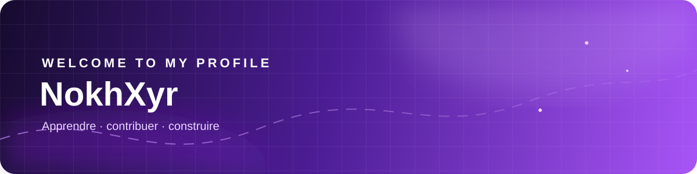
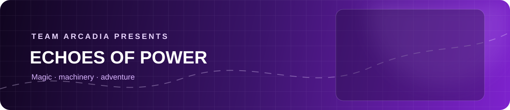
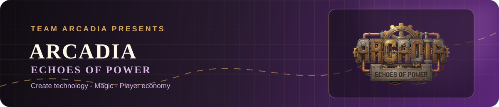

# Salut, moi c'est NokhXyr

### Développeur en apprentissage · Java

  
  
  

> J'aime contribuer quand je m'en sens capable — et progresser à chaque projet.

## À propos

Je commence à apprendre le développement, surtout **Java**, et je prends le temps de comprendre les choses à mon rythme. J'aime découvrir de nouvelles idées, aider quand je le peux et transformer petit à petit mes essais en projets concrets.

Mon expérience la plus importante jusqu'ici est ma contribution à **Team Arcadia**, l'équipe derrière **Arcadia: Echoes of Power**.

## Arcadia: Echoes of Power

  

### Un univers Minecraft où la magie rencontre la technologie

**Arcadia: Echoes of Power** est un projet communautaire ambitieux porté par [Team Arcadia](https://github.com/Team-Arcadia). Le modpack propose une progression travaillée, des mods sélectionnés et un univers en évolution, avec l'objectif de créer une aventure Minecraft unique.

**Tu veux en savoir plus ?** [Visite le site officiel](https://www.arcadia-echoes-of-power.fr/) · [découvre les projets GitHub de l'équipe](https://github.com/Team-Arcadia) · [suis le fondateur, laforetbrut](https://github.com/laforetbrut)

## Ce que j'apprends

  
  
  

- Apprendre les bases de Java et de la programmation
- Comprendre les projets communautaires et le modding Minecraft
- Contribuer quand je peux réellement apporter quelque chose
- Continuer à progresser, un commit à la fois

## En ce moment

Je découvre, j'expérimente et je contribue progressivement aux projets qui m'intéressent — avec une attention particulière pour l'écosystème **Arcadia**.

Merci de passer par ici 💜

---

## English version

# Hi, I'm NokhXyr

### Learning developer · Java

> I like contributing when I feel able to — and improving with every project.

## About me

I am starting to learn software development, especially **Java**, and I take the time to understand things at my own pace. I enjoy discovering new ideas, helping when I can, and gradually turning experiments into real projects.

My main experience so far has been contributing to **Team Arcadia**, the team behind **Arcadia: Echoes of Power**.

## Arcadia: Echoes of Power

  

### A Minecraft universe where magic meets technology

**Arcadia: Echoes of Power** is an ambitious community project created by [Team Arcadia](https://github.com/Team-Arcadia). The modpack features carefully designed progression, selected mods, and an evolving universe, with the goal of creating a unique Minecraft adventure.

**Want to learn more?** [Visit the official website](https://www.arcadia-echoes-of-power.fr/) · [explore the team's GitHub projects](https://github.com/Team-Arcadia) · [follow the founder, laforetbrut](https://github.com/laforetbrut)

## What I am learning

- Learning the fundamentals of Java and programming
- Exploring community projects and Minecraft modding
- Contributing when I can genuinely be useful
- Continuing to improve, one commit at a time

## Right now

I am discovering, experimenting, and gradually contributing to the projects that interest me — with a special focus on the **Arcadia** ecosystem.

Thanks for stopping by 💜

